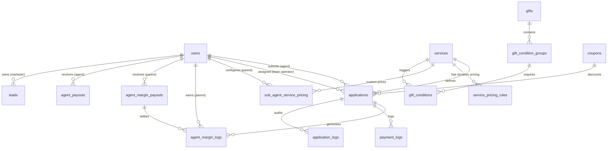

# EasyTax Master Platform Architecture & Feature Blueprint
> **Comprehensive System Specification & Drupal Implementation Guide**  
> *Target Drupal Endpoint Reference:* `http://easytaxdesign.local/admin/leads`  
> *Source Platform:* EasyTax Enterprise Laravel 12 Tax & Financial Services Suite

---

## 1. Executive Summary & Architectural Overview

The EasyTax platform is a **multi-tiered B2B government compliance and tax filing ecosystem**. It facilitates the collection, pricing, workflow management, operator assignment, document processing, commission distribution, and margin payouts for legal and tax services (Income Tax Returns, GST Registration, GST Return Filing, Company Incorporation, Balance Sheet Generation, Trademark Registration, etc.).

The system connects four operational worlds:
1. **Franchise / Agency Partners (Agents & Sub-Agents):** Frontline tax consultants, VLEs (Village Level Entrepreneurs), and CSC operators who collect client data, pay discounted wholesale platform rates, and earn commissions and margins.
2. **Backoffice Production Team (Operators):** Internal specialists assigned to process, prepare, verify, e-file, and upload government deliverables.
3. **Marketing & Field Acquisition (Marketers):** Field agents and business developers generating leads and onboarding bulk VLE networks.
4. **Platform Administration (Super Admins & Sub-Admins):** Complete control over application funnels, financial payouts, service pricing rules, operator piece-rates, promotional coupons, gamified gift milestones, and security.

### 1.1 Technical Stack Comparison & Drupal 10/11 Mapping

| Feature / Domain | Laravel Source Implementation | Drupal Target Equivalent |
| :--- | :--- | :--- |
| **User & Authentication** | `User` model, Laravel Breeze, SoftDeletes, Spatie Permission | Drupal Core User Entity, Roles, `field_agent_code`, `field_parent_agent` entity reference |
| **Application Entity** | `Application` model with JSON `form_data`, Enums, SoftDeletes | Custom Entity (`TaxApplication`) or Webform Submissions + custom metadata table |
| **Lead CRM Entity** | `Lead` model (`name`, `phone`, `source`, `status`, `notes`, `amount`) | Custom Entity (`CrmLead`) or Webform entity + Drupal Views |
| **Role-Based Access** | Middleware (`AdminMiddleware`, `AgentMiddleware`, `TeamMiddleware`, `MarketerMiddleware`, `ParentAgentOnlyMiddleware`) | Drupal Route Access Checkers (`CustomAccessCheck`), hook_node_access, or Entity Access Control Handlers |
| **Dynamic Form Engine** | `App\FormEngine\` + `config/service_forms.php` | Drupal Webforms (`yaml_form`) with custom Webform Handlers or Form API Plugins |
| **Data Tables UI** | Yajra DataTables (Server-side AJAX pagination, search, column filters) | Drupal Views DataTables plugin or custom REST/AJAX Controller with DataTables.js |
| **Media & Vault Storage** | `spatie/laravel-medialibrary` with `private` disk and collections | Drupal Media Entity (`media`) using `private://` file scheme with access control checks |
| **Financial Ledger & Margins** | `AgentMarginLog`, `AgentMarginPayout`, `AgentPayout` | Custom Database Tables / Custom Entities with transactional integrity |
| **PDF Generation** | `barryvdh/laravel-dompdf` (Balance Sheet, Reports) | `dompdf/dompdf` via custom Drupal service or Drupal Print/PDF module |
| **PDF Text Extraction** | `smalot/pdfparser` (Auto-extract 15-digit ITR Ack No, turnover, profit) | `smalot/pdfparser` integrated via Composer in custom Drupal module |
| **Payment Gateway** | Razorpay SDK (`RazorpayService`) & PhonePe (`PhonePeService`) | Drupal Commerce Razorpay module or custom payment gateway controller |
| **Audit Trails** | `spatie/laravel-activitylog` | Drupal Core `watchdog` / `dblog` or `entity_activity_tracker` module |

---

## 2. Global Role & Permission Hierarchy

```
                    ┌──────────────────────────────┐
                    │  SUPER ADMIN / SUPERVISOR   │
                    │   (Full Unrestricted Access) │
                    └──────────────┬───────────────┘
                                   │
         ┌─────────────────────────┼─────────────────────────┐
         ▼                         ▼                         ▼
┌──────────────────┐     ┌──────────────────┐     ┌──────────────────┐
│    SUB-ADMIN     │     │  INTERNAL TEAM   │     │  FIELD MARKETER  │
│ (PII Masking ON, │     │  (Operators /    │     │  (Lead Gen, VLE  │
│  No Data Export) │     │   Processors)    │     │  Client Booking) │
└──────────────────┘     └──────────────────┘     └──────────────────┘
                                                             │
         ┌───────────────────────────────────────────────────┘
         ▼
┌──────────────────────────────────────────────┐
│          PRIMARY PARENT AGENT                │
│ (Agency Head: Team Management, Pricing,     │
│  Accrued Margin Ledger, Gifts & Payouts)     │
└──────────────────────┬───────────────────────┘
                       │
                       ▼
┌──────────────────────────────────────────────┐
│           SUB-AGENT / TEAM MEMBER            │
│ (Scoped: Submits Client Apps, pays Parent's  │
│  custom price, no access to financial ledger)│
└──────────────────────────────────────────────┘
```

### Role Specifications

#### 1. Super Admin (`ADMIN` / `SUPER_ADMIN`)
- **Scope:** Complete access to all pages, dashboards, financials, and configurations.
- **Capabilities:**
  - View overall business revenue, platform fees, agent commission liability, and operator costs.
  - Manage services, pricing rules, and field requirements.
  - Reassign applications to operators (`assigned_to`).
  - Configure dynamic sidebar notification badges (color, metric, active state).
  - Manage coupons, promotional campaigns, and global password resets.
  - Review accrued agency margins, execute settlements with bank UTR reference numbers.
  - Review and batch commission payouts.
  - Switch portals seamlessly via encrypted SSO token (`/admin/switch-server/{target}`).

#### 2. Sub-Admin (`SUB-ADMIN`)
- **Security Guardrails:**
  - **PII Data Masking:** Mobile numbers, WhatsApp numbers, email addresses, PAN numbers, and Aadhaar numbers are masked on-screen (e.g., `98765*****`, `ABCDE****F`).
  - **Export Lock:** Hard-blocked with HTTP 403 from executing bulk CSV exports or individual application exports.
  - **Financial Visibility:** Revenue numbers and commission amounts are hidden from their dashboard view.

#### 3. Parent / Primary Agent (`AGENT` where `parent_id IS NULL`)
- **Scope:** The business owner / franchise partner.
- **Capabilities:**
  - Submit client applications across all active catalog services.
  - View, search, and track all submitted applications for their direct clients and sub-agents.
  - View unlocked and upcoming **Gift Milestones** across monthly, quarterly, and yearly periods.
  - **Team Management:** Add, edit, suspend, and bulk-import sub-agents (`/agent/team`).
  - **Custom Pricing Rules:** Set retail price and commission for each sub-agent or all sub-agents (`/agent/team-pricing`).
  - **Margin Ledger:** Track extra margin earned from sub-agent submissions (`/agent/margin-ledger`), request payouts, and update bank account details.
  - Generate automated, branded Profit & Loss and Balance Sheet PDFs for clients.

#### 4. Sub-Agent (`AGENT` where `parent_id IS NOT NULL`)
- **Scope:** An employee, branch staff, or sub-partner of a Primary Agent.
- **Restrictions:**
  - Cannot access `/agent/team`, `/agent/team-pricing`, `/agent/margin-ledger`, `/agent/gifts`, or commission ledger.
  - Sees only their own submitted applications (`where sub_agent_id = user.id`).
  - Billed based on the pricing tier assigned by their Parent Agent.
  - If the Parent Agent account is suspended, the sub-agent is automatically locked out.

#### 5. Internal Team / Operator (`TEAM`)
- **Scope:** Document verification and filing specialists.
- **Capabilities:**
  - Isolated task dashboard (`/team/dashboard`) displaying **only** tasks assigned to their user ID (`assigned_to = Auth::id()`).
  - Can change status: `IN_PROGRESS`, `E_FILING`, `OTP_VERIFICATION`, `COMPLETED`.
  - Can record a public or internal `pending_reason` if filing is stuck.
  - Upload verified documents: ITR Acknowledgements, Computation Sheets, MOA, AOA, Incorporation Certificates, GST Certificates.
  - Generate client Balance Sheets and P&L statements.
  - Track their own piece-rate earnings per completed service.

#### 6. Field Marketer (`MARKETER`)
- **Scope:** Client and franchise acquisition reps.
- **Capabilities:**
  - Isolated CRM dashboard (`/marketer/dashboard`).
  - General Lead management (`/crm/leads`): capture prospects, record status, append timestamped notes.
  - VLE Lead management (`/crm/leads/vle`): capture CSC/VLE partners committing bulk lead quotas (minimum 10 leads).
  - Can only edit and view leads created by themselves.

#### 7. Client / End-Consumer (Public Signed Route)
- **Scope:** Zero-login tracking view (`/track/{application}?signature=...`).
- **Capabilities:**
  - Review step-by-step progress bar of their filing.
  - Download official deliverables (GST Certificate, ITR Acknowledgement) once marked `COMPLETED`.

---

## 3. Session & Fiscal Cycle Logic (`SessionResolver`)

EasyTax operates under split seasonal cycles rather than standard Gregorian years, critical for Indian tax seasons (Income Tax assessment cycles and GST audit windows):

```
Annual Cycle: September 1 to August 31 (e.g., 2025-26)
 ├── Session 1 (S1): September 1 to March 31  [Pre-close & Tax audit filing]
 └── Session 2 (S2): April 1 to August 31     [Peak ITR & Financial Year Close]
```

### Operational Rules:
1. Every application created is tagged with a `session_label` (e.g., `2025-26 S1`).
2. All dashboard metric cards, DataTables, and revenue calculations filter by the active session chosen in the global header `<x-session-switcher>`.
3. If no session is selected, the system calculates the current date against the bounds:
   - Month $\ge 9$ (Sep-Dec): Start year = current year, Session = `S1`.
   - Month $\le 3$ (Jan-Mar): Start year = current year - 1, Session = `S1`.
   - Month $4$ to $8$ (Apr-Aug): Start year = current year - 1, Session = `S2`.

---

## 4. CRM & Leads Management System (Target: `/admin/leads`)

> **Direct Match for `http://easytaxdesign.local/admin/leads`**

The CRM module manages prospective clients and VLE partnerships before they become paying applications.

### 4.1 Data Model: `leads` Table

| Field Name | Type | Constraints / Description |
| :--- | :--- | :--- |
| `id` | BigInt | Primary Key, Auto Increment |
| `name` | Varchar(255) | Full name of the lead or proprietor |
| `phone` | Varchar(20) | Contact number (Masked for sub-admins) |
| `email` | Varchar(255) | Nullable email address |
| `service_interested` | Varchar(255) | Service tag (e.g., "ITR Filing", "GST Registration") |
| `source` | Varchar(100) | `VLE` (for CSC operators) or direct source (`Website`, `Referral`, `Walk-in`) |
| `status` | Enum / Varchar | `NEW`, `CONTACTED`, `IN_DISCUSSION`, `CONVERTED`, `LOST` |
| `notes` | Text | Historical append-only notes log |
| `amount` | Int / Varchar | For VLE: stores lead commitment number (Min 10, up to 100+) |
| `marketer_id` | Foreign Key | References `users.id` (creator/owner of lead) |
| `created_at` / `updated_at` | Timestamps | Auditing and session assignment |

### 4.2 Lead Workflow & Business Rules

1. **Lead Segregation:**
   - **General Leads:** Managed at `/crm/leads`. Contains retail prospects.
   - **VLE Bulk Leads:** Managed at `/crm/leads/vle`. Dedicated to agents committing $\ge 10$ leads.
2. **Access Control:**
   - **Marketer:** Query is scoped `where('marketer_id', auth()->id())`. Marketers cannot access leads belonging to other staff.
   - **Admin:** Views all leads across all marketers. Has a column displaying `marketer_name` or `Direct / None`.
3. **Timestamped Notes Append-Only Engine:**
   - When updating a lead, new notes are prepended with `[dd M, hh:mm A]: ` and concatenated onto existing notes using double line breaks:
     ```php
     $timestamp = now()->format('d M, h:i A');
     $lead->notes = $lead->notes . "\n\n[" . $timestamp . ']: ' . $request->notes;
     ```
4. **Status Lifecycle:**
   - `NEW` $\rightarrow$ Blue soft badge. Default upon entry.
   - `CONTACTED` $\rightarrow$ Yellow warning soft badge.
   - `IN_DISCUSSION` $\rightarrow$ Indigo primary soft badge.
   - `CONVERTED` $\rightarrow$ Green success badge. Lead converts into an agent or submitted application.
   - `LOST` $\rightarrow$ Red danger badge. Prospect declined.

---

## 5. Comprehensive Page-by-Page Feature Specifications

### 5.1 Admin Portal (`/admin/*`)

#### Page 1: Admin Dashboard (`/admin/dashboard`)
- **Route:** `admin.dashboard`
- **Controller:** `App\Http\Controllers\Admin\DashboardController@index`
- **Widgets & Features:**
  1. **Header Bar:** Global Session Switcher dropdown, Support Helpline pill, Live date/time display.
  2. **Application Funnel KPI Cards (7 Total):**
     - *Total Applications:* All applications excluding Draft/Cancelled and Failed payments.
     - *Completed Apps:* Status = `COMPLETED`.
     - *Pending Apps:* Active processing queue.
     - *Processed (Draft/Fail):* Abandoned checkouts or failed payments.
     - *Total Active Agents:* Count of verified agents.
     - *Total Revenue:* Cumulative `amount - commission_amount`.
     - *Total Commission:* Cumulative agent commission pool.
     - *Total Marketers:* Count of field marketing users.
  3. **Analytics Charts:**
     - *Applications Overview:* Monthly bar chart comparing application intake over time.
     - *Revenue Growth:* Line chart tracking net company receipts.
  4. **Dynamic Top Agents Leaderboard:**
     - Filter dropdown: Top 10, 15, 20, 25, 50, 100, or "All Agents".
     - Real-time AJAX re-rendering without reloading the page.
     - Visual Ranking Badges: Rank 1 (Gold gradient), Rank 2 (Silver gradient), Rank 3 (Bronze gradient), Rank 4+ (Slate pill).
     - Displays: Agent name, unique Agent Code, Applications Count, Total Revenue Generated, Commission Earned.
  5. **Top 10 Services Widget:** Services ranked by application volume with revenue totals.
  6. **Recent 10 Applications Feed:** Real-time incoming filings with clickable View links.
  7. **Cross-Portal Switcher:** Dropdown redirecting to B2B Master, Upwest, Marketing, and UAT portals using encrypted 60-second HMAC tokens.

#### Page 2: Applications Queue (`/admin/applications`)
- **Route:** `admin.applications.index`
- **Controller:** `App\Http\Controllers\Admin\ApplicationController@index` & `@data`
- **Tab Categorization:**
  - Tab 1: `ITR Filing` (`?type=itr-filing`)
  - Tab 2: `GST Registration` (`?type=gst-registration`)
  - Tab 3: `GST Return Filing` (`?type=gst-return-filing`)
  - Tab 4: `Other Applications` (`?type=other`)
  - Tab 5: `Incomplete & Abandoned` (`?type=incomplete`)
- **DataTable Capabilities:**
  - Server-side AJAX with Yajra DataTables.
  - Multi-column search (Application ID, Agent Name, Agent Code, Form Data JSON search).
  - Filters: Agent dropdown, Service dropdown, Status dropdown, Payment Status dropdown, Date From/To.
  - Trash filter toggle: View soft-deleted applications with instant "Restore" capability.
  - **Dynamic Primary Field Column:** Automatically pulls and displays the most critical identifying field configured for that service (e.g., PAN Number for ITR, Firm Name for GST).
  - **Live Operator Assignment:** Inline `<select>` dropdown in the table row allowing Admin to reassign the task to any operator without navigating away.
  - **ITR Special Columns:**
    - *Ack Number:* Displays extracted 15-digit number and direct download link.
    - *Computation Sheet:* One-click download.
    - *Balance Sheet Generator:* Button turns into "View / Download / Regenerate" once generated.
  - **GST Annual Alert Badges:** Badges for "Renewal Due" (expired 365 days) or "Expiring Soon" (within 30 days) + completed months counter (`X/12 Done`).
  - **Bulk Operations:** Checkbox selection to move multiple items to `IN_PROGRESS` at once.
  - **Export Engine:**
    - Single CSV Export: UTF-8 BOM formatted, sanitizes formula injection characters (`=`, `+`, `-`, `@`).
    - Filtered Group Export: Groups applications by service type into clean CSV sheets.
    - Master Export: Bundles multi-service exports into a single downloaded `.zip` file.

#### Page 3: Application Detail & Action Center (`/admin/applications/{id}`)
- **Route:** `admin.applications.show`
- **Controller:** `App\Http\Controllers\Admin\ApplicationController@show`
- **Sections:**
  1. **Status Progression Bar:** Visual stepper showing current stage (`SUBMITTED` $\rightarrow$ `IN_PROGRESS` $\rightarrow$ `E_FILING` $\rightarrow$ `OTP_VERIFICATION` $\rightarrow$ `COMPLETED`).
  2. **Applicant & Form Data:** Form Engine JSON parsed into structured tables.
  3. **Credentials Management Box:**
     - Stores Government Portal Username and Password.
     - Password is encrypted using `Illuminate\Support\Facades\Crypt` at rest and masked with eye toggle on UI.
     - Final Deliverable Upload: Automatic classification (e.g., "Incorporation Certificate" vs "GST Certificate").
  4. **Document Vault:**
     - Tabs for Agent Uploads, Admin Deliverables, and Receipts.
     - Inline viewer for PDFs and images.
     - Deletion protection and audit trail logging.
  5. **Financial Breakdown:** Service Base Price, Commission Paid, Coupon Discount, Sub-Agent Paid, Company Retained, Parent Margin Accrued.
  6. **Override Payout Field:** Admin override input to adjust operator compensation for irregular tasks.
  7. **Activity Audit Log:** Chronological record of all updates, causations, and timestamps.
  8. **Email Automation:** Marking status as `COMPLETED` automatically dispatches the branded completion email to the client with their unique tracking link.

#### Page 4: GST Annual 12-Month Compliance Manager (`/admin/applications/{id}`)
- **Business Logic:** GST Annual packages require monthly return filings over a 365-day lifecycle.
- **Features:**
  - 12 individual month rows (e.g., April 2025 to March 2026).
  - Per-month Status: `PENDING`, `IN_PROGRESS`, `FILED`, `NOT_APPLICABLE`.
  - Filing Date & Government ARN (Application Reference Number) input.
  - Filing Receipt upload (PDF/Image) stored under `gst_monthly_receipts` media collection.
  - Expiry countdown alert for agents and admin.

#### Page 5: Smart Balance Sheet & P&L Generator (`/admin/applications/{id}/balance-sheet`)
- **Route:** `admin.applications.balance-sheet`
- **Controller:** `App\Http\Controllers\Admin\ApplicationController@balanceSheetForm` & `@generateBalanceSheetPdf`
- **OCR / PDF Data Extraction:**
  - Automatically parses the uploaded `computation_sheet` PDF using regex to extract:
    - Inventories / Closing Stock
    - Sundry Debtors
    - Cash in Hand
    - Sundry Creditors
    - Gross Receipts / Turnover
    - Net Profit Declared
- **Interactive Calculation Form:**
  - *Trading Account:* Sales, Closing Stock, Opening Stock, Purchases, Direct Expenses $\rightarrow$ Gross Profit.
  - *Profit & Loss:* Indirect Expenses (Salaries, Rent, Electricity, Repairs, Loan Interest) $\rightarrow$ Net Profit.
  - *Balance Sheet:* Opening Capital, Net Profit, Drawings, Bank Loans, Creditors $\rightarrow$ Assets = Liabilities balance check.
- **Output:** Generates a signed, official balance sheet PDF and saves it directly to the application's document vault.

#### Page 6: Agent Management (`/admin/agents`)
- **Route:** `admin.agents.index`
- **Controller:** `App\Http\Controllers\Admin\AgentController`
- **Features:**
  - DataTable of all registered Primary Agents.
  - Columns: Name, Unique Agent Code, Total Sub-Agents, Total Applications, Gross Commission Earned, Total Payouts Disbursed, Status Toggle (`Active` / `Suspend`).
  - Agent Profile View (`/admin/agents/{id}`): Deep analytics, service breakdown pie chart, list of attached sub-agents, historical earnings.
  - Create / Edit Agent with custom mobile, WhatsApp, and banking information.

#### Page 7: Internal Team & Operator Management (`/admin/team`)
- **Route:** `admin.team.index`
- **Controller:** `App\Http\Controllers\Admin\TeamController`
- **Features:**
  - List of all internal backoffice operators.
  - Active task count per operator.
  - Operator Detail & Rate Configuration (`/admin/team/{id}/profile`):
    - Set custom piece-rate payment for every service (e.g., Operator earns ₹80 per ITR filing completed, ₹150 per Private Limited company).
  - Payout Disbursement Engine (`/admin/team/{id}/payout/create`):
    - Tracks completed tasks multiplied by operator service rates.
    - FIFO Unpaid Months Deductor: Tracks which months have outstanding balances and allocates lump-sum payouts against oldest completed months first.

#### Page 8: Payouts & Commission Engine (`/admin/payouts`)
- **Route:** `admin.payouts.index`
- **Controller:** `App\Http\Controllers\Admin\PayoutController`
- **Features:**
  - Direct Commission Payouts table.
  - Date-range preview calculator (`/admin/payouts/preview`).
  - Batch payout generator: Locks applications, generates voucher, flags applications as `payout_id`.
  - Mark Paid modal: Records settlement date, payment mode (NEFT/RTGS, UPI, Cheque), and reference number.

#### Page 9: Agency Margin Settlements (`/admin/margin-payouts`)
- **Route:** `admin.margin-payouts.index`
- **Controller:** `App\Http\Controllers\Admin\MarginPayoutController`
- **Business Logic:** When a sub-agent submits an application, their markup above company minimum is credited to the Primary Agent as an `ACCRUED` margin.
- **Features:**
  - KPI Cards: Total Accrued Margins (pending settlement), Total Settled to Date, Pending Agencies Count.
  - Pending Settlements Table: Lists agencies holding accrued funds with their bank account/UPI info.
  - Settle Modal: Admin selects accrued items, enters UTR / Transaction Reference, and marks as settled.
  - Dispatches automated notification (`ParentMarginSettledNotification`) to the agent.

#### Page 10: Dynamic Sidebar Tab Badges Configuration (`/admin/tab-badges`)
- **Route:** `admin.tab-badges.index`
- **Controller:** `App\Http\Controllers\Admin\TabBadgeController`
- **Features:**
  - Admin can configure up to 4 circular numerical counter badges on sidebar links.
  - Select Metric per badge: `Today's Volume`, `Pending Review`, `Submitted (New)`, `In Progress`, `Under Review`, `Completed Today`, `Failed Payment`.
  - Select Color: Red (Alert), Blue (Info), Amber (Warning), Green (Success), Purple, Pink, Teal, Indigo.
  - Sets custom tooltip and active/inactive state.
  - Cached for 60 seconds with instant invalidation upon application status updates.

#### Page 11: Promotional Coupons Manager (`/admin/coupons`)
- **Route:** `admin.coupons.index`
- **Controller:** `App\Http\Controllers\Admin\CouponController`
- **Features:**
  - Create promotional bonus codes (e.g., `BONUS500`).
  - Set bonus commission amount added to the agent's account upon submission.
  - Global Max Uses limit + Max Uses Per Agent limit.
  - Target Service Lock: restrict coupon to specific service IDs (e.g., ITR only).
  - Target Agent Lock: restrict coupon to a whitelist of agent IDs.
  - Race condition prevention via atomic `DB::table('coupons')->lockForUpdate()`.

#### Page 12: Gamified Gifts & Milestone Rewards (`/admin/gifts`)
- **Route:** `admin.gifts.index` & `admin.gifts.eligibility.hub`
- **Controller:** `App\Http\Controllers\Admin\GiftController` & `GiftEligibilityController`
- **Features:**
  - Define tangible rewards (e.g., "Smart Watch", "Laptop", "Goa Trip", "Electric Scooter").
  - Upload branded banner poster (`gift_banner` media collection).
  - Period Type: `Monthly`, `Quarterly`, `Yearly`.
  - Condition Builder (`GiftConditionGroup` & `GiftCondition`):
    - Multi-service OR/AND logic: e.g., Group 1: 50 ITRs; Group 2: 20 GST Registrations + 20 GST Annual Packages.
    - Upsell Same-PAN matching: GST Registration milestone only unlocks if the same applicant PAN also purchased GST Annual package.
  - Eligibility Hub: Calculates which agents crossed thresholds within any selected period and displays winner lists for fulfillment.

#### Page 13: Bulk Password Reset Tool (`/admin/bulk-passwords`)
- **Route:** `admin.bulk-passwords.index`
- **Controller:** `App\Http\Controllers\Admin\BulkPasswordController`
- **Features:**
  - Multi-select users across Agents, Operators, and Marketers.
  - Security Guardrail: Super Admins are filtered out and protected from accidental bulk updates.
  - Sets and hashes new password across all selected IDs in a single transaction.

---

### 5.2 Agent Portal (`/agent/*` & `/services/*`)

#### Page 1: Agent Dashboard (`/agent/dashboard`)
- **Route:** `agent.dashboard`
- **Controller:** `App\Http\Controllers\Agent\DashboardController@index`
- **Widgets:**
  1. **Funnels KPI:** Total Applications, Completed Filings, In Progress tasks.
  2. **Application Velocity Chart:** 6-month historical intake chart.
  3. **Status Breakdown Donut Chart:** Visual ratio of completed vs pending vs rejected filings.
  4. **Team Activity Summary (Parent Agents Only):** Total Sub-Agents count, Active members count, Sub-agent submissions count, Total margin earned.
  5. **Gift Milestones Progress Trackers:**
     - Displays active milestone cards with interactive progress bar.
     - Shows current count vs required threshold, remaining filings needed, and unlocked state.
  6. **Recent Applications Table:** Quick-access list with instant status indicators.

#### Page 2: Service Catalog (`/services`)
- **Route:** `services.index`
- **Controller:** `App\Http\Controllers\Front\ServiceController@index`
- **Features:**
  - Grid of all government and compliance services.
  - Search and sort order display.
  - Displays Retail Price, Agent Commission, and Net Amount Payable.

#### Page 3: Dynamic Application Form (`/services/{slug}`)
- **Route:** `services.show` & `applications.store`
- **Controller:** `App\Http\Controllers\Front\ServiceController@show` & `ApplicationController@store`
- **Features:**
  - Dynamic Form Rendering powered by `config/service_forms.php`.
  - Multi-section accordion or stepped layouts (Personal Info, Business Details, Contact, Identity Docs).
  - Repeater blocks (Dynamic Director 1, Director 2, Partner 1, Partner 2 blocks).
  - **Dynamic Price Engine:** Form calculates real-time price based on selected inputs:
    - *ITR:* Multiplies price by number of assessment years selected (1, 2, or 3 years); checks business income and capital gains flags.
    - *GST Return:* Resolves price based on Turnover Range and Return Frequency (Monthly/Quarterly).
    - *GST Annual Package:* Adjusts price based on Annual Turnover tier.
  - **Coupon Verification Modal:** Checks validity, remaining usage quota, and applies bonus commission.
  - **Payment Integration:**
    - Sub-Agent checks: Computes sub-agent price vs company minimum vs parent margin.
    - Direct payment checkout via Razorpay (or PhonePe).
    - Captures order in `PaymentLog` and verifies cryptographic webhook signature before transitioning to `SUBMITTED`.

#### Page 4: My Applications Queue (`/agent/applications`)
- **Route:** `agent.applications.index`
- **Controller:** `App\Http\Controllers\Agent\ApplicationController@index`
- **Features:**
  - Tabs matching admin: `ITR Filing`, `GST Registration`, `GST Return`, `Other Applications`.
  - Scoped to agent: Parent agent can toggle filter between "All Team", "Self", or specific sub-agents.
  - Sub-agents can only see their own submissions.
  - One-click document downloads once completed (ITR Ack, Certificate).
  - Ability to soft-delete draft or cancelled applications.

#### Page 5: Team Management (`/agent/team`) - *Parent Agent Only*
- **Route:** `agent.sub-agents.index`
- **Controller:** `App\Http\Controllers\Agent\SubAgentController`
- **Features:**
  - List of all sub-agents operating under this agency franchise.
  - KPIs: Total Members, Active Members, Team Applications Count, Total Margin Accrued.
  - Create Sub-Agent: Name, email, phone, auto-generated unique agent code.
  - Bulk Creation & CSV Import: Download CSV template, populate agents, bulk upload.
  - Toggle Active/Suspended status.
  - Reset Sub-Agent Password modal.

#### Page 6: Team Custom Pricing Matrix (`/agent/team-pricing`) - *Parent Agent Only*
- **Route:** `agent.team-pricing.index`
- **Controller:** `App\Http\Controllers\Agent\SubAgentPricingController`
- **Business Logic & Guardrails:**
  - Primary agent can customize what each service costs their sub-agents.
  - Target: Apply to **All Team Members** or a **Specific Sub-Agent**.
  - **Zero-Loss Guardrail:**
    $$\text{Sub-Agent Net Payable} = \text{Sub-Agent Price} - \text{Sub-Agent Commission}$$
    $$\text{Company Minimum} = \text{Base Service Price} - \text{Base Commission}$$
    $$\text{Guardrail Condition: } \text{Sub-Agent Net Payable} \ge \text{Company Minimum}$$
    The system throws an immediate validation exception if the parent tries to set a price where the company would lose money.
  - Parent Margin is calculated as:
    $$\text{Parent Margin} = \text{Sub-Agent Net Payable} - \text{Company Minimum}$$

#### Page 7: Margin Earnings Ledger (`/agent/margin-ledger`) - *Parent Agent Only*
- **Route:** `agent.margin-ledger.index`
- **Controller:** `App\Http\Controllers\Agent\MarginLedgerController`
- **Features:**
  - Financial KPI Cards: Accrued Balance (Awaiting Settlement), Settled to Bank, Total Lifetime Margin Earned.
  - Banking Details Card: Form to update Bank Name, Account Number, IFSC Code, Account Holder Name, and UPI ID.
  - Real-time Transaction Ledger: Details each sub-agent submission, amount paid, company share, and exact accrued margin.
  - Payouts History Table: Details past disbursement vouchers, payment modes, and bank UTR reference codes.

---

### 5.3 Internal Team / Operator Portal (`/team/*`)

#### Page 1: Operator Workspace (`/team/dashboard`)
- **Route:** `team.dashboard`
- **Controller:** `App\Http\Controllers\Team\DashboardController@index`
- **Security Isolation:**
  - Strict filter: `Application::where('assigned_to', Auth::id())`.
  - Operators cannot see platform revenue, agency margins, or other operators' queues.
- **KPI Cards:** Total Assigned Tasks, Active / In-Progress Tasks, Completed Tasks.
- **DataTable:** Displays client name, service name, submission date, and current status.

#### Page 2: Operator Task Processing View (`/team/applications/{id}`)
- **Route:** `team.applications.show`
- **Controller:** `App\Http\Controllers\Team\DashboardController@show`
- **Capabilities:**
  - Review submitted form details and uploaded client identity files.
  - Update Status: `IN_PROGRESS`, `E_FILING`, `OTP_VERIFICATION`, `COMPLETED`.
  - Record `pending_reason` if filing is waiting on customer OTP or government clearance.
  - Document Management: Upload official government receipts, MOA/AOA, and acknowledgement slips.
  - Balance Sheet & P&L Generator: Dedicated operator tool to calculate and output client balance sheets.
  - Completion triggers automated notification email to the client with secure tracking link.

---

### 5.4 Marketer Portal (`/marketer/*` & `/crm/*`)

#### Page 1: Marketer Dashboard (`/marketer/dashboard`)
- **Route:** `marketer.dashboard`
- **Controller:** `App\Http\Controllers\Admin\LeadController@dashboard`
- **Features:**
  - Scoped strictly to `where('marketer_id', auth()->id())`.
  - KPI Metrics: Total Leads Captured, Converted to Clients, Lost / Closed.
  - Quick action: "Add VLE Customer" button.
  - Feed of 5 most recent leads with inline status update button.

#### Page 2: General Leads List & Entry (`/crm/leads`)
- **Route:** `crm.leads.index`, `crm.leads.create`, `crm.leads.edit`
- **Features:**
  - Captures Retail Prospects: Name, Phone, Email, Service of Interest, Source, Initial Notes.
  - Status updates (`NEW` $\rightarrow$ `CONTACTED` $\rightarrow$ `IN_DISCUSSION` $\rightarrow$ `CONVERTED` $\rightarrow$ `LOST`).
  - Appends historical call/meeting notes with automated timestamps.

#### Page 3: VLE Partnership Capture (`/crm/leads/vle` & `/marketer/vle/create`)
- **Route:** `crm.leads.vle.index` & `crm.leads.vle.create`
- **Business Logic:**
  - Designed for field onboarding of Village Level Entrepreneurs (CSC kiosks, cyber cafes).
  - Hardcodes `source = 'VLE'`.
  - Enforces minimum quota: `amount` field must be $\ge 10$ leads (dropdown from 10 to 20, or "100+ Leads").

---

### 5.5 Public Client Tracking (`/track/{application}`)

- **Route:** `tracking.show`
- **Controller:** `App\Http\Controllers\Front\ApplicationController@track`
- **Security:** Protected via Laravel Signed URLs (`middleware('signed')`).
- **Features:**
  - No login or registration required.
  - Clean client-facing progress bar showing current status.
  - Displays business name, filing reference, and date.
  - Once marked `COMPLETED`, provides official download buttons for deliverables (GST Certificate, Incorporation Deed, ITR-V Ack).

---

## 6. Complete Database Schema Blueprint



### Table 1: `users`
```sql
CREATE TABLE `users` (
  `id` bigint unsigned NOT NULL AUTO_INCREMENT,
  `name` varchar(255) NOT NULL,
  `email` varchar(255) NOT NULL UNIQUE,
  `password` varchar(255) NOT NULL,
  `role` varchar(50) DEFAULT 'AGENT', -- ADMIN, SUB-ADMIN, AGENT, TEAM, MARKETER
  `agent_code` varchar(50) NULL UNIQUE, -- e.g. ET84920
  `parent_id` bigint unsigned NULL, -- Self-referencing FK to users.id (for Sub-Agents)
  `marketer_id` bigint unsigned NULL, -- Attached onboarding marketer
  `is_active` tinyint(1) NOT NULL DEFAULT 1,
  `mobile_number` varchar(20) NULL,
  `whatsapp_no` varchar(20) NULL,
  `address` text NULL,
  `notification_preference` varchar(50) DEFAULT 'ALL',
  -- Bank Settlement Details
  `bank_name` varchar(150) NULL,
  `bank_account_number` varchar(100) NULL,
  `bank_ifsc` varchar(50) NULL,
  `bank_account_holder` varchar(150) NULL,
  `bank_upi_id` varchar(100) NULL,
  `remember_token` varchar(100) NULL,
  `created_at` timestamp NULL,
  `updated_at` timestamp NULL,
  `deleted_at` timestamp NULL,
  PRIMARY KEY (`id`),
  FOREIGN KEY (`parent_id`) REFERENCES `users` (`id`) ON DELETE CASCADE
);
```

### Table 2: `applications`
```sql
CREATE TABLE `applications` (
  `id` bigint unsigned NOT NULL AUTO_INCREMENT,
  `agent_id` bigint unsigned NOT NULL, -- Primary Parent Agent
  `sub_agent_id` bigint unsigned NULL, -- Sub-Agent who performed submission
  `service_id` bigint unsigned NOT NULL,
  `assigned_to` bigint unsigned NULL, -- Operator/Team User ID
  `form_data` json NOT NULL, -- Full dynamic form submission data
  `status` varchar(50) NOT NULL DEFAULT 'DRAFT', -- DRAFT, SUBMITTED, UNDER_REVIEW, DOCUMENTS_REQUIRED, IN_PROGRESS, E_FILING, OTP_VERIFICATION, COMPLETED, REJECTED, CANCELLED
  `pending_reason` text NULL,
  `payment_status` varchar(50) NOT NULL DEFAULT 'PENDING', -- PENDING, PAID, FAILED, REFUNDED
  `payment_reference` varchar(150) NULL, -- Razorpay Order / Payment ID
  `expected_amount_paise` bigint NULL,
  `amount` decimal(10,2) NOT NULL DEFAULT 0.00, -- Base retail service price
  `commission_amount` decimal(10,2) NOT NULL DEFAULT 0.00, -- Commission given to parent
  `coupon_id` bigint unsigned NULL,
  `coupon_bonus` decimal(10,2) NOT NULL DEFAULT 0.00,
  -- Sub-Agent & Margin Pricing Fields
  `sub_agent_amount` decimal(10,2) NULL,
  `sub_agent_commission` decimal(10,2) NULL,
  `company_minimum_amount` decimal(10,2) NULL,
  `parent_margin` decimal(10,2) NOT NULL DEFAULT 0.00,
  `parent_margin_status` varchar(50) NOT NULL DEFAULT 'NONE', -- NONE, PENDING, ACCRUED, PAID, CANCELLED
  `parent_margin_refunded_at` timestamp NULL,
  `override_payout_amount` decimal(10,2) NULL, -- Operator custom rate override
  `payout_id` bigint unsigned NULL, -- Direct Agent Commission Payout batch ID
  `session_label` varchar(50) NOT NULL, -- e.g. "2025-26 S1"
  `started_at` timestamp NULL,
  `submitted_at` timestamp NULL,
  `completed_at` timestamp NULL,
  `created_at` timestamp NULL,
  `updated_at` timestamp NULL,
  `deleted_at` timestamp NULL,
  PRIMARY KEY (`id`),
  FOREIGN KEY (`agent_id`) REFERENCES `users` (`id`),
  FOREIGN KEY (`sub_agent_id`) REFERENCES `users` (`id`),
  FOREIGN KEY (`assigned_to`) REFERENCES `users` (`id`)
);
```

### Table 3: `agent_margin_logs` (Agency Margin Accounting)
```sql
CREATE TABLE `agent_margin_logs` (
  `id` bigint unsigned NOT NULL AUTO_INCREMENT,
  `parent_agent_id` bigint unsigned NOT NULL,
  `sub_agent_id` bigint unsigned NOT NULL,
  `application_id` bigint unsigned NOT NULL,
  `sub_agent_paid` decimal(10,2) NOT NULL,
  `company_retained` decimal(10,2) NOT NULL,
  `margin_amount` decimal(10,2) NOT NULL,
  `status` varchar(50) NOT NULL DEFAULT 'ACCRUED', -- ACCRUED, PAID, CANCELLED
  `margin_payout_id` bigint unsigned NULL, -- References agent_margin_payouts.id
  `payout_reference` varchar(150) NULL, -- Bank UTR / Cheque No
  `refund_reference` varchar(150) NULL,
  `notes` text NULL,
  `created_at` timestamp NULL,
  `updated_at` timestamp NULL,
  PRIMARY KEY (`id`),
  FOREIGN KEY (`parent_agent_id`) REFERENCES `users` (`id`),
  FOREIGN KEY (`sub_agent_id`) REFERENCES `users` (`id`),
  FOREIGN KEY (`application_id`) REFERENCES `applications` (`id`)
);
```

### Table 4: `sub_agent_service_pricing` (Custom Markup Rules)
```sql
CREATE TABLE `sub_agent_service_pricing` (
  `id` bigint unsigned NOT NULL AUTO_INCREMENT,
  `parent_agent_id` bigint unsigned NOT NULL,
  `sub_agent_id` bigint unsigned NULL, -- NULL = Applies to ALL sub-agents of this parent
  `service_id` bigint unsigned NOT NULL,
  `price` decimal(10,2) NOT NULL,
  `commission` decimal(10,2) NOT NULL DEFAULT 0.00,
  `created_at` timestamp NULL,
  `updated_at` timestamp NULL,
  PRIMARY KEY (`id`),
  UNIQUE KEY `unique_parent_sub_service` (`parent_agent_id`, `sub_agent_id`, `service_id`)
);
```

### Table 5: `leads` (CRM Pipeline)
```sql
CREATE TABLE `leads` (
  `id` bigint unsigned NOT NULL AUTO_INCREMENT,
  `marketer_id` bigint unsigned NULL,
  `name` varchar(255) NOT NULL,
  `phone` varchar(20) NOT NULL,
  `email` varchar(255) NULL,
  `service_interested` varchar(255) NULL,
  `source` varchar(100) DEFAULT 'Direct', -- 'VLE', 'Website', 'Referral'
  `status` varchar(50) NOT NULL DEFAULT 'NEW', -- NEW, CONTACTED, IN_DISCUSSION, CONVERTED, LOST
  `amount` varchar(50) NULL, -- For VLE: stores committed lead quota (e.g. "15", "100+")
  `notes` text NULL,
  `created_at` timestamp NULL,
  `updated_at` timestamp NULL,
  PRIMARY KEY (`id`),
  FOREIGN KEY (`marketer_id`) REFERENCES `users` (`id`)
);
```

### Table 6: `operator_service_rates` & `operator_payouts`
```sql
CREATE TABLE `operator_service_rates` (
  `id` bigint unsigned NOT NULL AUTO_INCREMENT,
  `operator_id` bigint unsigned NOT NULL,
  `service_id` bigint unsigned NOT NULL,
  `price` decimal(10,2) NOT NULL DEFAULT 0.00,
  `updated_at` timestamp NULL,
  PRIMARY KEY (`id`),
  UNIQUE KEY `operator_service_unique` (`operator_id`, `service_id`)
);

CREATE TABLE `operator_payouts` (
  `id` bigint unsigned NOT NULL AUTO_INCREMENT,
  `operator_id` bigint unsigned NOT NULL,
  `amount` decimal(10,2) NOT NULL,
  `payment_note` varchar(255) NULL,
  `paid_at` timestamp NOT NULL,
  `created_at` timestamp NULL,
  `updated_at` timestamp NULL,
  PRIMARY KEY (`id`)
);
```

### Table 7: `gifts`, `gift_condition_groups`, `gift_conditions`
```sql
CREATE TABLE `gifts` (
  `id` bigint unsigned NOT NULL AUTO_INCREMENT,
  `name` varchar(255) NOT NULL,
  `description` text NULL,
  `period_type` varchar(50) NOT NULL DEFAULT 'monthly', -- monthly, quarterly, yearly, session
  `is_active` tinyint(1) NOT NULL DEFAULT 1,
  `created_at` timestamp NULL,
  `updated_at` timestamp NULL,
  PRIMARY KEY (`id`)
);

CREATE TABLE `gift_condition_groups` (
  `id` bigint unsigned NOT NULL AUTO_INCREMENT,
  `gift_id` bigint unsigned NOT NULL,
  `sort_order` int NOT NULL DEFAULT 0,
  PRIMARY KEY (`id`),
  FOREIGN KEY (`gift_id`) REFERENCES `gifts` (`id`) ON DELETE CASCADE
);

CREATE TABLE `gift_conditions` (
  `id` bigint unsigned NOT NULL AUTO_INCREMENT,
  `gift_condition_group_id` bigint unsigned NOT NULL,
  `service_id` bigint unsigned NOT NULL,
  `min_count` int NOT NULL DEFAULT 1,
  PRIMARY KEY (`id`),
  FOREIGN KEY (`gift_condition_group_id`) REFERENCES `gift_condition_groups` (`id`) ON DELETE CASCADE
);
```

---

## 7. Dynamic Form Engine Specifications (`FormEngine`)

The dynamic form engine renders custom forms for 20+ financial services using declarative configuration schemas in `config/service_forms.php`.

### Supported Field Types
1. `text`: Standard text inputs with length validation.
2. `number` / `digits`: Numeric inputs with regex constraints.
3. `date`: Calendar pickers.
4. `select`: Dropdowns with key-value option pairs.
5. `textarea`: Multi-line text inputs.
6. `file`: Document upload handlers with MIME type and byte size restrictions.
7. `repeater / numbered sub-sections`: Auto-merging numbered blocks (e.g., `director_1_details`, `director_2_details`).

### Active Service Form Catalog
- `itr-filing`: Assessment year multipliers (1 to 3 years), Gross Turnover, Business Income, Capital Gains, Form 16, Bank statements.
- `gst-registration`: Proprietorship / Partnership / Private Limited, Trade Name, Nature of Business, Electricity Bill, Rent Agreement, Consent Letter, NOC.
- `gst-return-filing`: Return Frequency (Monthly/Quarterly), Turnover brackets, Sales & Purchase summary registers.
- `gst-annual-package`: 12-month composite schedule tracking.
- `private-limited-company-registration`: 2 Director KYC, Proposed Names, Capital structure, MOA/AOA drafts, Registered Office utility bill.
- `section-8-company`: Non-profit objectives, Director KYC, Asset & Liability estimates.
- `fpo-registration`: Farmer Producer Organisation shareholder lists, territorial jurisdiction, minimum 10 member KYC.
- `llp-registration` & `opc-registration`: One Person Company nominee details, Limited Liability Partnership agreements.
- `msme-udyam-registration`: Aadhaar-linked OTP authentication, Enterprise activity classification, Investment in plant & machinery.
- `trademark-registration`: Brand name/logo image, Class (1-45), Power of Attorney, Date of First Use.
- `project-report`: Bank loan CMA data, Projected Balance Sheet, Debt Service Coverage Ratio (DSCR).

---

## 8. Step-by-Step Drupal Implementation Roadmap

Follow this phased blueprint to recreate this architecture inside your live Drupal installation at `http://easytaxdesign.local`:

### Phase 1: Core Foundation & Leads CRM (`http://easytaxdesign.local/admin/leads`)
1. **Roles Configuration:** Create Drupal roles: `Super Admin`, `Sub Admin`, `Parent Agent`, `Sub Agent`, `Operator`, `Marketer`.
2. **Leads Entity / Webform:**
   - Create custom Content Type or Custom Entity `crm_lead` with fields: `field_lead_name`, `field_phone`, `field_email`, `field_service_interested`, `field_source`, `field_status`, `field_lead_quota`, `field_notes_history`, `field_marketer_ref`.
3. **Leads Views:**
   - Configure Drupal View at `/admin/leads` utilizing DataTables format.
   - Add access filter: If user has role `Marketer`, filter `field_marketer_ref = Current User ID`. If `Admin`, show all leads with marketer name.
   - Status badge styling via View field rewrite templates.
4. **Timestamped Notes Form Handler:**
   - Create custom Form or Webform Handler that intercepts note updates and appends `[date, time]: new note` to the top or bottom of `field_notes_history`.

### Phase 2: User Hierarchy & Sub-Agent Architecture
1. **Extend User Entity:** Add `field_agent_code`, `field_parent_agent` (entity reference to user), `field_is_active`, and Bank settlement fields.
2. **Access Middleware:** Implement a custom `AccessCheck` service in Drupal (`EasyTaxAccessCheck`) to intercept routes and ensure deactivated parents block sub-agent access.
3. **Sub-Agent Management View:** Build `/agent/team` view for parent agents to manage users where `field_parent_agent == current_user->id()`.

### Phase 3: Tax Applications & Workflow Engine
1. **Application Entity:** Build custom entity `tax_application` storing status, payment status, financial calculations, operator assignments, and session labels.
2. **Webform Integration:** Create Webforms for each service slug (`itr-filing`, `gst-registration`), utilizing Webform conditional logic and private file uploads (`private://documents/`).
3. **State Transitions:** Integrate Drupal Workflow or ECA module to handle transitions (`SUBMITTED` $\rightarrow$ `IN_PROGRESS` $\rightarrow$ `COMPLETED`).
4. **Token-Signed Tracking Route:** Create custom controller at `/track/{id}` verifying HMAC tokens for public client status tracking.

### Phase 4: Financial Engines, Margins & Payouts
1. **Sub-Agent Pricing Table:** Create custom table `sub_agent_service_pricing` and UI at `/agent/team-pricing`.
2. **Margin Accrual Event Subscriber:** Hook into Webform submission / payment confirmation:
   - Calculate $\text{Sub-Agent Paid} - \text{Company Minimum} = \text{Parent Margin}$.
   - Write transaction record to `agent_margin_logs`.
3. **Admin Settlement Workspace:** Replicate `/admin/margin-payouts` to allow admins to disburse accrued balances and record bank UTR codes.

### Phase 5: Dashboards, Reports & Document Processing
1. **Admin & Agent Dashboards:** Build responsive layout matching the 3x2 KPI funnel cards, Chart.js integrations, and dynamic Top Agents leaderboard.
2. **PDF Generation Service:** Integrate Dompdf in a custom Drupal service to output Balance Sheet and P&L PDFs from application form fields.
3. **OCR / Regex Document Parser:** Port the `smalot/pdfparser` logic into Drupal to auto-extract ITR Acknowledgement numbers upon operator document upload.

---

## 9. Verification & Quality Checklist

Before taking the Drupal implementation live, verify these operational checkpoints:

- [ ] **Role Isolation:** A sub-agent attempting to access `/agent/team` or `/agent/margin-ledger` receives an immediate HTTP 403 Forbidden.
- [ ] **Parent Suspension Cascade:** Deactivating a primary agent account in Admin immediately prevents all associated sub-agents from logging in or submitting applications.
- [ ] **Zero-Loss Pricing Guardrail:** Setting a sub-agent price below the company minimum receivable throws an on-screen validation error and blocks saving.
- [ ] **Margin Accrual Precision:** When a sub-agent pays via payment gateway, the parent agent's ledger immediately reflects the exact accrued margin difference.
- [ ] **PII Masking Integrity:** Logging in as `Sub-Admin` masks all PAN numbers, Aadhaar numbers, phone numbers, and emails across all tables and detail views.
- [ ] **Export Security:** Sub-Admins are strictly prevented from downloading CSV exports or master zip bundles.
- [ ] **Signed Tracking Links:** Tampering with the query parameters or hash on `/track/{application}` results in an invalid signature error.
- [ ] **Session Filtering:** Switching between S1 and S2 updates all dashboard metrics, DataTables, and revenue figures to reflect only applications within that date boundary.
